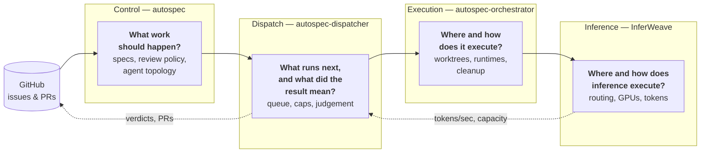
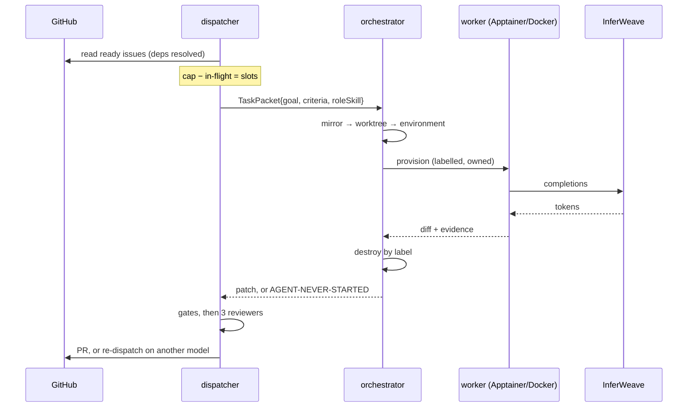
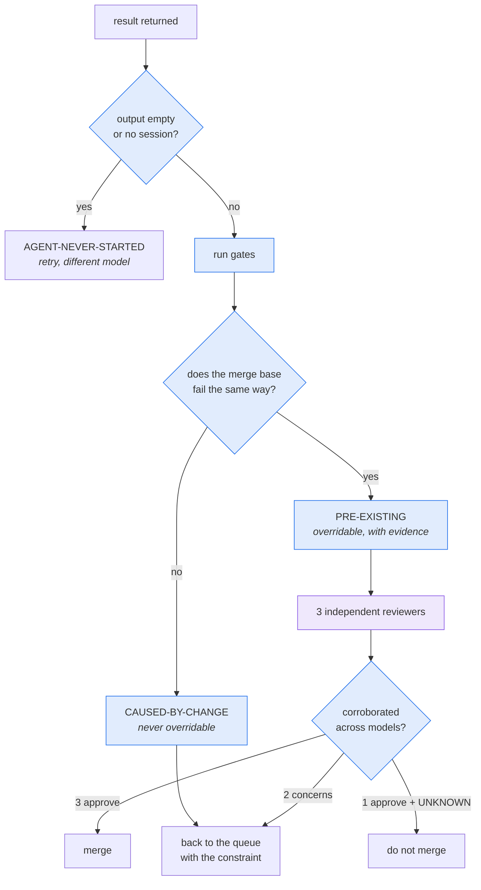
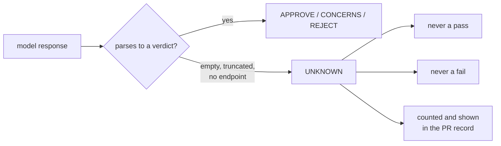
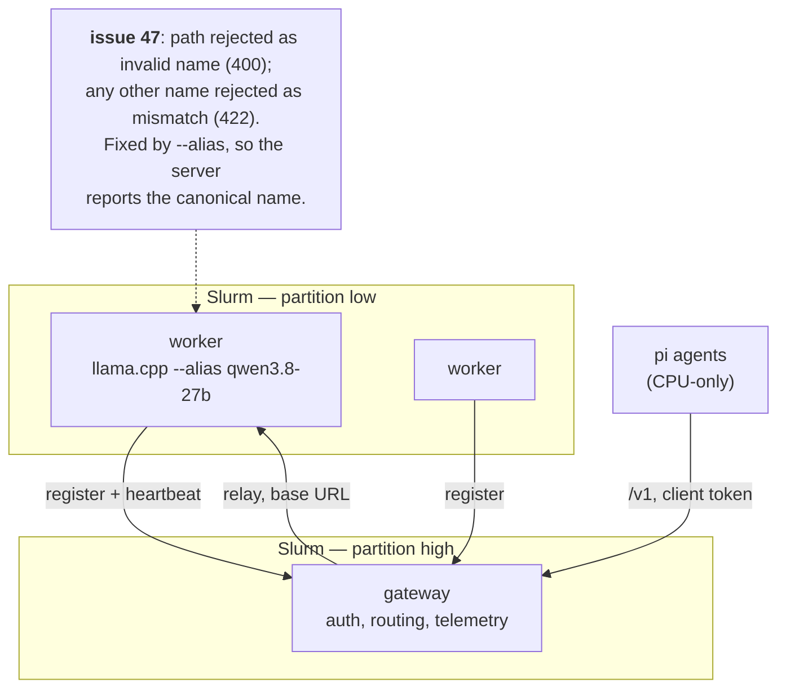
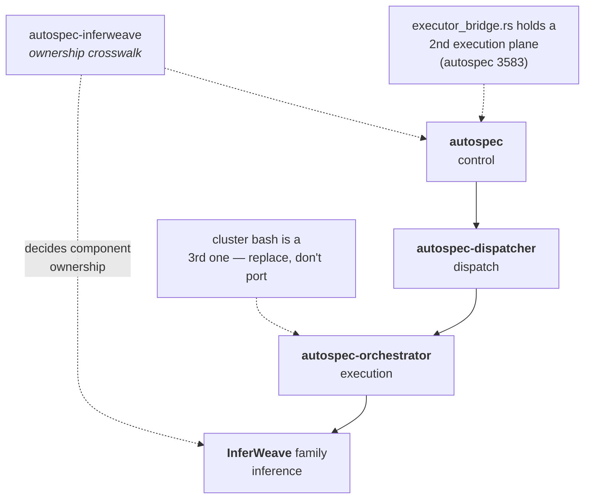
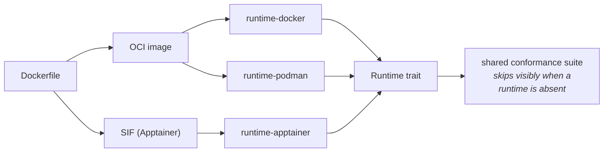

# How the pieces fit

Four planes, four questions. Nothing in one plane may answer another's question —
that rule is what keeps the boundaries honest, and every violation found so far
has been a duplication.

## One issue, end to end

The path a single issue takes. Note where the two kinds of decision live:
**code decides pass/fail, a model decides meaning.**

## The judgement split

This is the core of the dispatch plane. A model that could flip a failing gate
to passing could merge broken code by being confidently wrong once.

Blue is decided by code. Purple is the only step a model owns.

## Why UNKNOWN is its own state

Measured across three reviewers and four patches: **5 of 12 verdicts were
`UNKNOWN`**, every one `finish=length` — the model spent its whole token budget
reasoning and returned empty content.

Reading those as approvals would have merged unreviewed changes.

## Inference: registration and the request path

Workers register **upward**; nothing dials in. The registration deadlock that
kept the gateway at zero workers for hours is marked.

Two things this diagram encodes that cost real time:

- the gateway **joins the request path onto the registered endpoint**, so registration must send the *base* URL — `…/v1` registered becomes `…/v1/v1/models` and 404s
- GPUs exist only in `low` (preemptible); `high` has none for this account, so agent and gateway jobs go to `high` and every GPU worker is evictable

## Repository map

Component ownership across the program is decided in **`autospec-inferweave`**
(`docs/specs/2026-09-01-inferweave-integrated-program-crosswalk-design.md`), not
per-repo. Check it before building anything that touches inference, gateways,
dashboards or node protocol — three duplications have already come from not
doing so.

## Runtimes are interchangeable

The SIF is built **from the same Dockerfile**, so image content is identical
across runtimes and the conformance suite needs no per-runtime fixture.

Slurm has no Docker. A suite that *requires* a Docker daemon can never run where
this code actually executes, so tests select whatever runtime the host has and
skip — visibly — when none is present.
